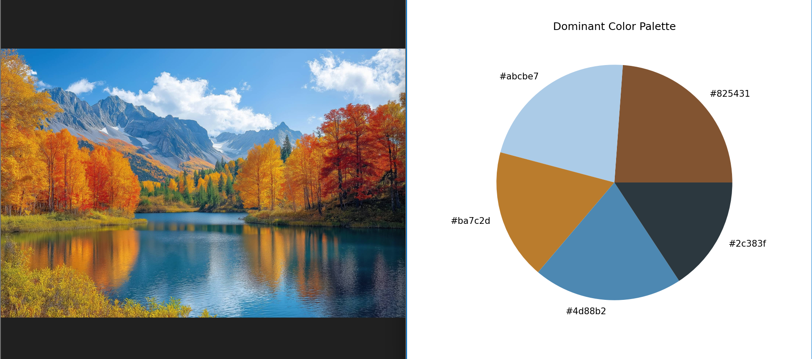

# 🎨 AI Color Palette Generator

[](https://ai-color-palette-generator-rbppny6hpabrcmep4o97aj.streamlit.app/)


> **"Where Machine Learning meets Aesthetics."**
> A web application that extracts dominant color schemes from images using Unsupervised Learning.

## Live Demo
**Input Image vs. AI Extracted Palette**


### [Click here to try the Live App]([https://ai-color-palette-generator-rbppny6hpabrcmep4o97aj.streamlit.app/])

---

## How It Works
This tool relies on **K-Means Clustering**, a popular Machine Learning algorithm.
1.  **Pixel Mapping:** The app reads the image as an array of pixels (Red, Green, Blue).
2.  **Clustering:** It plots every pixel in a 3D space and finds "clusters" of similar colors.
3.  **Centroid Calculation:** The algorithm finds the mathematical center of these clusters to determine the most dominant colors.

## Technical Stack
* **Language:** Python
* **ML Engine:** Scikit-Learn (KMeans)
* **Image Processing:** OpenCV (Headless)
* **Frontend:** Streamlit Cloud

## Local Installation
If you want to run this locally on your machine:

```bash
# 1. Clone the repository
git clone [https://github.com/DanahKh8/AI-Color-Palette-Generator.git](https://github.com/DanahKh8/AI-Color-Palette-Generator.git)
cd AI-Color-Palette-Generator

# 2. Install dependencies
pip install -r requirements.txt

# 3. Run the app
streamlit run app.py
